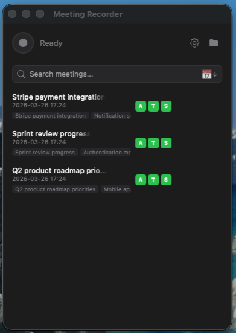

# Meeting Recorder

A macOS menu bar app that automatically records Zoom and Teams calls, transcribes them locally using Whisper, and generates AI-powered meeting summaries with Ollama. Everything runs locally on your Mac — no data leaves your machine.


<p align="center">
  
</p>

## Features

### Working
- **Dual Audio Capture** — Records both your microphone and system audio via BlackHole
- **Local Transcription** — Uses [lightning-whisper-mlx](https://github.com/mustafaaljadery/lightning-whisper-mlx), optimized for Apple Silicon
- **Speaker Diarization** — Identifies speakers using pyannote community-1 with MPS GPU acceleration
- **Voice Fingerprinting** — Learns speaker voices and auto-identifies them in future calls
- **AI Summaries** — Generates actionable meeting summaries with Ollama (default: Qwen3 8B)
- **Window UI** — Full meeting manager with search, tags, sort, and per-meeting pipeline status
- **Crash-Safe Pipeline** — Checkpoint system tracks each stage; click to retry after a failure
- **Streaming Recorder** — Audio streams to disk in chunks, no OOM on long meetings
- **Meeting Tags** — Auto-extracted topics and people from summaries, editable, searchable
- **AI Rename** — Generate meeting titles from summaries via Ollama, or rename manually
- **Cancel Processing** — Stop transcription or summarization mid-way and resume later
- **Memory Safe** — Subprocess isolation frees all model memory after each stage
- **Auto-Restart** — Launch agent restarts the app if it crashes
- **Desktop App** — Double-click to launch, auto-starts on login
- **Speaker Naming Tool** — Interactive CLI to assign names to speakers after transcription
- **Privacy First** — 100% local processing, no cloud services, no data collection

### Beta
- **Auto-Record Calls** — Detects Zoom/Teams calls via audio devices and process monitoring (Mon-Fri). May not detect all call types reliably.

## Requirements

- macOS (Apple Silicon recommended — M1/M2/M3/M4)
- Python 3.9+
- [BlackHole](https://existential.audio/blackhole/) (virtual audio driver for system audio capture)
- [Ollama](https://ollama.ai/) (for meeting summaries)
- [HuggingFace Token](https://huggingface.co/settings/tokens) (free, for speaker diarization)

## Installation

### Quick Install (Recommended)

```bash
# Clone the repository
git clone https://github.com/Mazurevitz/meeting-scribe.git
cd meeting-scribe

# Run the installer
./install.sh
```

The installer handles everything: Homebrew, Python deps, BlackHole, Ollama, desktop app, and launch-at-login setup.

### Manual Installation

<details>
<summary>Click to expand manual steps</summary>

#### 1. Install Dependencies

```bash
pip install -r requirements.txt
```

#### 2. Install BlackHole (System Audio Capture)

```bash
brew install blackhole-2ch
```

After installation, configure Audio MIDI Setup to capture system audio. See [setup guide](scripts/setup_blackhole.md) for detailed instructions.

#### 3. Install Ollama (Optional, for Summaries)

```bash
brew install ollama
ollama pull qwen3:8b
ollama serve  # Keep running in background
```

#### 4. Set HuggingFace Token (Required for Speaker Diarization)

```bash
# Get a free token from https://huggingface.co/settings/tokens
# Accept model terms at https://huggingface.co/pyannote/speaker-diarization-community-1

# Create .env file
echo 'HF_TOKEN=hf_your_token_here' > .env

# Or set environment variable
export HF_TOKEN="hf_your_token_here"
```

</details>

## Usage

### Start the App

**Option 1: Desktop App (Recommended)**
- Double-click `MeetingRecorder.app` in Applications
- Or use Spotlight: `Cmd+Space` → "Meeting Recorder"

**Option 2: Command Line**
```bash
python run.py
```

A microphone icon appears in your menu bar.

### Menu Options

| Option | Description |
|--------|-------------|
| **Start/Stop Recording** | Manually control recording |
| **Auto-Record Calls (Mon-Fri)** | Toggle automatic recording for Zoom/Teams |
| **Auto-Transcribe** | Automatically transcribe after recording stops |
| **Auto-Summarize** | Automatically summarize after transcription |
| **Speaker Diarization** | Identify different speakers in transcript |
| **Transcribe Latest** | Transcribe the most recent recording |
| **Summarize Latest** | Generate AI summary of the latest transcript |
| **Retry Failed** | Re-run a failed transcription or summarization |
| **Copy Summary to Clipboard** | Copy the latest summary for pasting |
| **Devices** | Select microphone |
| **Models** | Select Ollama model for summaries |
| **Open Recordings Folder** | Open saved recordings in Finder |
| **Status** | Check BlackHole, Ollama, diarization, and pending pipeline status |

### Naming Speakers

After transcription, use the interactive naming tool:

```bash
python name_speakers.py
```

This shows quotes from each speaker so you can identify them:

```
--- SPEAKER_03 (5 segments) ---
  [00:00] "Working on notifications for some issues..."
  [00:06] "Is the auto update stuff working properly now?"

Name for SPEAKER_03 (Enter to skip): Andy
  -> Will assign: SPEAKER_03 -> Andy
```

The tool updates the transcript with real names. Voice fingerprints are saved automatically during the next transcription, so speakers are auto-identified in future calls.

### Managing Known People

```bash
# List known speakers
python manage_speakers.py list

# Rename a speaker
python manage_speakers.py rename "Old Name" "New Name"

# Remove a speaker
python manage_speakers.py remove "Name"
```

People and teams are stored in `~/.meeting-recorder/people.json`.

### Hands-Free Pipeline

With default settings, the complete flow is automatic:

1. **Call starts** → Recording begins automatically
2. **Call ends** → Recording stops, audio saved to disk
3. **Auto-transcribe** → Transcript generated with speaker labels
4. **Auto-summarize** → AI summary with action items created
5. **Notification** → Click to open the summary

If any step fails, the pipeline checkpoint saves your progress. Use **Retry Failed** from the menu to pick up where it left off — no need to re-record or re-transcribe.

### Output Files

All files are saved to `~/Documents/MeetingRecordings/`:

```
MeetingRecordings/
├── meeting_20240115_143022.wav            # Audio recording
├── meeting_20240115_143022.txt            # Transcript (with speaker names)
├── meeting_20240115_143022.summary.md     # AI-generated summary
└── meeting_20240115_143022.pipeline.json  # Pipeline checkpoint (auto-cleaned)
```

### Summary Format

Summaries use an actionable format:

```markdown
## Summary
2-3 sentences about the meeting.

## Action Items
- [ ] **Andy**: Test auto-update functionality
- [ ] **Maribeth**: Gather business requirements from client

## Key Decisions
- Implementing feature X in version 10.2

## Topics Discussed
- Notifications: fixing issues raised by June
- Authentication: Fido key MFA support

## People Mentioned
- **Andy**: Working on notifications
- **Mark**: Project manager, concerned about timeline
```

## Architecture

```
┌─────────────────┐     ┌──────────────────┐     ┌─────────────────┐
│  Menu Bar (rumps)│────>│  Audio Recorder  │────>│  Pipeline       │
└─────────────────┘     │  (streams to     │     │  Checkpoints    │
        │               │   disk in chunks)│     └─────────────────┘
        │               └──────────────────┘              │
        │                     │      │              ┌─────┴─────┐
        v               ┌────┘      └────┐         v           v
┌──────────────┐  ┌──────────┐    ┌───────────┐  ┌───────┐ ┌───────────┐
│ Call Monitor │  │ Mic Input│    │ BlackHole │  │Whisper│ │  Ollama   │
│ (devices +   │  └──────────┘    │(sys audio)│  │(subprocess)│(summaries)│
│  processes)  │                  └───────────┘  └───────┘ └───────────┘
└──────────────┘                                     │
                                                     v
                                              ┌─────────────┐
                                              │  Pyannote   │
                                              │  community-1│
                                              │(diarization)│
                                              └──────┬──────┘
                                                     v
                                              ┌──────────────┐
                                              │  Speaker DB  │
                                              │(fingerprints)│
                                              └──────────────┘
```

### Crash Safety

- **Audio**: Streams to disk every 5 seconds. Even a crash mid-recording leaves a valid WAV file up to the last flush.
- **Pipeline**: Each stage writes a checkpoint file. On restart, the app resumes from the last completed stage.
- **Launch Agent**: macOS auto-restarts the app if it crashes (`KeepAlive` with `SuccessfulExit`).
- **Call Monitor**: Thread auto-restarts on error, with fallback process detection.

### Subprocess Isolation

Heavy ML models (Whisper, Pyannote) run in isolated subprocesses. When transcription completes, the subprocess exits and ALL memory is freed by the OS. This prevents memory leaks common with long-running ML processes.

### Memory Budget (16GB Mac)

All stages run sequentially — models never compete for memory:

| Stage | RAM Used | Notes |
|-------|----------|-------|
| Recording | ~200 MB | Streaming to disk, not accumulating |
| Transcription | ~6 GB | Whisper subprocess, freed after |
| Diarization | ~7 GB | Pyannote subprocess, freed after |
| Summarization | ~9 GB | Ollama (separate process) |

## Models

### Transcription

| Model | Speed | Accuracy | Use Case |
|-------|-------|----------|----------|
| `distil-large-v3` | Fast | Great | **Default, recommended** (~1.5GB) |
| `distil-medium.en` | Faster | Good | Lighter machines |
| `tiny.en`, `base.en` | Fastest | Lower | Quick drafts |
| `large-v3` | Slow | Best | Critical meetings |

### Speaker Diarization

Uses [pyannote community-1](https://huggingface.co/pyannote/speaker-diarization-community-1) — better speaker counting and assignment than pyannote 3.1, with MPS (Apple Silicon GPU) acceleration.

### Summarization (Ollama)

Any Ollama model works. Select from menu under **Models > Ollama Model**.

Recommended for 16GB Macs:
- `qwen3:8b` — **Default**, best quality/speed for 16GB (~5GB, 32K context)
- `llama3.1:latest` — Solid alternative
- `mistral:7b` — Fast and capable

## Data Storage

| Location | Contents |
|----------|----------|
| `~/Documents/MeetingRecordings/` | Audio, transcripts, summaries, pipeline checkpoints |
| `~/.meeting-recorder/speakers.json` | Voice fingerprints |
| `~/.meeting-recorder/people.json` | Known people & teams |
| `~/.config/meeting-scribe/config.json` | App settings |
| `~/.config/meeting-scribe/project_dir` | Project path (set by installer) |

## Troubleshooting

### BlackHole not detected

```bash
brew reinstall blackhole-2ch
# Restart your Mac after installing
```

### No system audio in recordings

1. Open **Audio MIDI Setup**
2. Create a **Multi-Output Device** with both your speakers and BlackHole
3. Set it as your system output in **System Preferences > Sound**

### Ollama not available

```bash
ollama serve  # Start the server
curl http://localhost:11434/api/tags  # Verify it's running
```

### Speaker diarization not working

Check **Status** menu. Common issues:

1. **HF_TOKEN not set**: Create `.env` file with `HF_TOKEN=hf_...`
2. **Model terms not accepted**: Visit https://huggingface.co/pyannote/speaker-diarization-community-1

### App not starting at login

```bash
./scripts/install_launch_agent.sh  # Reinstall
./scripts/uninstall_launch_agent.sh  # Or remove
```

### High memory usage

Memory is automatically freed after each transcription due to subprocess isolation. If memory stays high, restart the app.

### Failed transcription or summary

Use **Retry Failed** from the menu bar. The pipeline checkpoint tracks your progress, so it picks up from the last completed stage — no need to re-record or re-transcribe.

## Contributing

Contributions are welcome! Please feel free to submit a Pull Request.

## License

MIT License — see [LICENSE](LICENSE) for details.

## Acknowledgments

- [rumps](https://github.com/jaredks/rumps) — macOS menu bar apps in Python
- [lightning-whisper-mlx](https://github.com/mustafaaljadery/lightning-whisper-mlx) — Fast Whisper for Apple Silicon
- [pyannote-audio](https://github.com/pyannote/pyannote-audio) — Speaker diarization & voice embeddings
- [BlackHole](https://existential.audio/blackhole/) — Virtual audio driver
- [Ollama](https://ollama.ai/) — Local LLM runner
